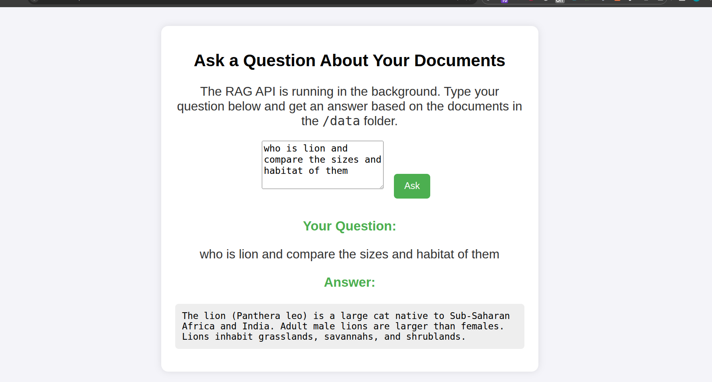

# RAG-FileQuery

This project implements a complete **Retriever-Augmented Generation (RAG)** pipeline using the **Pathway** framework. It indexes local documents (like PDFs and text files), generates embeddings, and uses **Google's Gemini** model to answer questions based on the content of those documents.

The application is architected as two microservices and is designed to run seamlessly with **Docker Compose**, providing a robust and reproducible environment.


<p align="center"><i>The two-service architecture: A Flask web UI and a Pathway RAG API backend.</i></p>


---

## ✨ Features

-   **Two-Service Architecture:** A clean separation between the Flask web frontend (`web`) and the Pathway RAG backend (`rag-api`).
-   **Local Document Indexing:** Processes files directly from a local `data/` directory.
-   **PDF & Text Parsing:** Automatically extracts text from various file formats, including PDFs (even scanned ones, with OCR).
-   **Advanced RAG Pipeline:** Uses `sentence-transformers` for creating embeddings and `pathway` to build and serve a vector index.
-   **Gemini-Powered QA:** Leverages a powerful Gemini model via `litellm` for intelligent question answering.
-   **Containerized & Reproducible:** Runs with Docker Compose for a one-command setup that handles all dependencies, including system-level ones for OCR.
-   **Simple Web Interface:** A clean web UI to ask questions and see the generated answers.

---

## 🛠️ Core Technologies

-   **Containerization:** Docker, Docker Compose
-   **Backend Frameworks:** Pathway, Flask, Gunicorn
-e   **AI Engine:** Google Gemini (via `litellm`)
-   **Embedding Model:** `sentence-transformers`
-   **File Parsing:** `unstructured[pdf]`

---

## 🚀 Getting Started with Docker (Recommended)

This is the simplest and most reliable method. It automatically handles all Python and system-level dependencies (like OCR tools) inside containers.

### Prerequisites

-   Git
-   [Docker](https://docs.docker.com/get-docker/) and [Docker Compose](https://docs.docker.com/compose/install/)
-   A Google Account to get an API key.

### Step 1: Clone the Repository

```bash
git clone https://github.com/Per0x1de-1337/RAG-FileQuery.git
cd RAG-FileQuery
```

### Step 2: Get Your Google API Key

1.  Go to **[Google AI Studio](https://aistudio.google.com/)**.
2.  Click **"Get API key"** and **"Create API key in new project"**.
3.  Copy the generated API key.

### Step 3: Create and Configure the `.env` File

This file securely stores your API key and other configuration. Create a file named `.env` in the project's root directory and add the following content:

```ini
# .env file

# A strong, random secret key for Flask sessions
FLASK_SECRET_KEY='a-very-long-and-random-secret-string-for-security'

# This tells the web UI how to contact the RAG API inside the Docker network. Do not change.
RAG_API_URL=http://rag-api:8000

# Your Pathway license key (the demo key works fine)
PATHWAY_LICENSE_KEY="demo-license-key-with-telemetry"

# --- IMPORTANT ---
# Paste your Google API Key here
GEMINI_API_KEY="YOUR_API_KEY_HERE"
```
**Note:** The `.gitignore` file is configured to prevent `.env` from being committed to Git.

### Step 4: Add Your Documents

Place the PDF and/or text files you want to query into the `data/` directory.

### Step 5: Build and Run!

With Docker running, use Docker Compose to build the images and start both services with a single command:

```bash
docker-compose up --build
```

-   `--build`: Builds the Docker image using the `Dockerfile`. You only need to run this the first time or if you change `requirements.txt`.
-   The first run may take a few minutes to download the base images and install dependencies.
-   You will see logs from both the `web` and `rag-api` services.

### Step 6: Use the Application

Once the services are running, open your web browser and navigate to:
**[http://localhost:5000](http://localhost:5000)**

You can now ask questions about the documents you placed in the `data` folder.

### Stopping the Application

-   To stop the application, press `Ctrl + C` in the terminal where Docker Compose is running.
-   To remove the containers and network, run: `docker-compose down`.

---

## ▶️ Running with a Local Python Environment

This method requires manual installation of Python packages and system dependencies. It's more complex but useful for direct debugging.

<details>
  <summary>Click to expand instructions for the local setup.</summary>
  
  ### 1. Prerequisites
  - Python 3.10+
  - A virtual environment tool like `venv`.
  - **System-level OCR dependencies** for handling scanned PDFs.

  On Debian/Ubuntu:
  ```bash
  sudo apt-get update && sudo apt-get install -y tesseract-ocr poppler-utils
  ```
  
  On Fedora/CentOS/RHEL:
  ```bash
  sudo dnf install -y tesseract poppler-utils
  ```
  
  On macOS (using Homebrew):
  ```bash
  brew install tesseract poppler
  ```

  ### 2. Set Up Virtual Environment
  ```bash
  # Create the virtual environment
  python3 -m venv agent-venv

  # Activate it
  source agent-venv/bin/activate
  ```

  ### 3. Install Python Dependencies
  ```bash
  pip install -r requirements.txt
  ```
  
  ### 4. Configure the `.env` File for Local Use
  Create a `.env` file and use `localhost` for the API URL, as both servers will be running on your local machine.

  ```ini
  # .env file (for LOCAL setup)
  FLASK_SECRET_KEY='a-local-dev-secret-key'
  RAG_API_URL=http://localhost:8000
  PATHWAY_LICENSE_KEY="demo-license-key-with-telemetry"
  GEMINI_API_KEY="YOUR_API_KEY_HERE"
  ```

  ### 5. Add Your Documents
  Place your files into the `data/` directory.

  ### 6. Run the Application
  You need to run each service in a separate terminal.
  
  **In Terminal 1 (Start the RAG API):**
  ```bash
  # Make sure the venv is active
  python3 app.py
  ```
  > Wait until you see the message `======== Running on http://0.0.0.0:8000 ========`.

  **In Terminal 2 (Start the Web UI):**
  ```bash
  # Make sure the venv is active
  python3 server.py
  ```
  > Wait until you see the message `* Running on http://127.0.0.1:5000`.

  ### 7. Use the Application
  Open your web browser and navigate to **[http://localhost:5000](http://localhost:5000)**.
</details>

---

## 📁 Project Structure

```
.
├── app.py                # The Pathway RAG API service (backend)
├── server.py             # The Flask web server (frontend)
├── docker-compose.yml    # Docker Compose orchestrator
├── Dockerfile            # Instructions to build the container image
├── config.yaml           # Configuration for the RAG service
├── requirements.txt      # Python dependencies
├── .env                  # (You create this) Stores secrets and API keys
├── data/                 # Folder for your input documents
├── templates/
│   └── index.html        # Web UI template
└── static/
    └── styles.css        # Web UI styles
```

---

## 🤝 Contributing

Contributions are welcome! If you have ideas for new features or improvements, please fork the repository and open a pull request.

---

## 📄 License

This project is licensed under the MIT License. See the `LICENSE` file for details.
